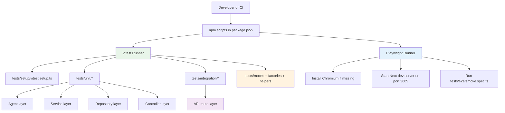

# TEST-01: Add Testing Framework (Vitest + Playwright) - Completion Summary

Document Status: COMPLETED  
Sprint: Sprint-3  
Completion Date: April 13, 2026  
Epic ID: TEST-01  
Linked Story: Testing Baseline and Quality Gates  
Story Points Delivered: 5

---

## 1. Epic Summary

### Epic: TEST-01 - Add Testing Framework

Objective  
Establish a production-ready automated testing baseline in the existing Next.js 15 + Supabase + AI-agent architecture, with minimal disruption to current runtime behavior and maximum compatibility with the ESM TypeScript setup.

Status: COMPLETED  
Priority: High  
Sprint Assigned: Sprint-3  
Story Points: 5

Roles Affected:

- Engineering team - shared testing contracts and helpers for new development
- QA team - deterministic local and CI test execution paths
- DevOps/CI - executable scripts for unit, integration, coverage, and browser E2E

Scope Note:

- This document reports the TEST-01 testing framework deliverables from current branch diff against main.
- The current branch also includes non-testing feature files; those are listed in Appendix B and are out of TEST-01 scope.

---

## 2. Feature Overview

### What Was Built

A two-runner test architecture was implemented and validated:

- Vitest for unit and integration tests
- Playwright for browser E2E smoke and future journey expansion
- Shared mock/factory/helper foundation for Supabase and AI agent paths
- Standardized scripts in package configuration for local and CI execution

### Testing Workflows

Unit and integration flow

```text
Developer writes test in tests/unit or tests/integration
-> Vitest loads tests/setup/vitest.setup.ts
-> Alias @ resolves to project root
-> Mocks/factories isolate external dependencies
-> Assertions verify layer behavior
```

E2E flow

```text
npm run test:e2e
-> Ensures Playwright Chromium is installed
-> Starts Next dev server on port 3005
-> Runs tests/e2e against baseURL
-> Produces pass/fail signal for browser-level behavior
```

### Coverage Intent

- Unit: agents, services, repositories, controllers
- Integration: app/api route handlers with auth/controller mocks
- E2E: baseline route availability with room for critical user journey growth

---

## 3. Implementation Summary

### Files Created

| File Path                                                                                                                                                   | Purpose                                                    | Technology              |
| ----------------------------------------------------------------------------------------------------------------------------------------------------------- | ---------------------------------------------------------- | ----------------------- |
| [main-app/vitest.config.ts](../../../main-app/vitest.config.ts)                                                                                             | Vitest runtime, alias, include/exclude, coverage targeting | Vitest, V8 coverage     |
| [main-app/playwright.config.ts](../../../main-app/playwright.config.ts)                                                                                     | Playwright project config and web server wiring            | Playwright              |
| [main-app/tests/setup/vitest.setup.ts](../../../main-app/tests/setup/vitest.setup.ts)                                                                       | Global test setup, env defaults, cleanup/mocks reset       | Vitest, Testing Library |
| [main-app/tests/mocks/supabase.ts](../../../main-app/tests/mocks/supabase.ts)                                                                               | Chainable Supabase query builder/client mock utilities     | Vitest mocks            |
| [main-app/tests/mocks/langchain.ts](../../../main-app/tests/mocks/langchain.ts)                                                                             | Deterministic Groq/LangChain chain invocation mocks        | Vitest mocks            |
| [main-app/tests/factories/feedback.factory.ts](../../../main-app/tests/factories/feedback.factory.ts)                                                       | Typed test data builders for feedback/sentiment models     | TypeScript factories    |
| [main-app/tests/helpers/api-request.ts](../../../main-app/tests/helpers/api-request.ts)                                                                     | Request and route-param helpers for route tests            | Request API             |
| [main-app/tests/helpers/auth.ts](../../../main-app/tests/helpers/auth.ts)                                                                                   | Auth mock helpers for authenticated/unauthenticated paths  | Vitest mocks            |
| [main-app/tests/unit/agents/sentiment-agent.test.ts](../../../main-app/tests/unit/agents/sentiment-agent.test.ts)                                           | Agent layer skeleton tests                                 | Vitest                  |
| [main-app/tests/unit/services/feedback-analysis.service.test.ts](../../../main-app/tests/unit/services/feedback-analysis.service.test.ts)                   | Service layer skeleton tests                               | Vitest                  |
| [main-app/tests/unit/repositories/feedback.repository.test.ts](../../../main-app/tests/unit/repositories/feedback.repository.test.ts)                       | Repository layer skeleton tests                            | Vitest                  |
| [main-app/tests/unit/controllers/feedback.controller.test.ts](../../../main-app/tests/unit/controllers/feedback.controller.test.ts)                         | Controller layer skeleton tests                            | Vitest                  |
| [main-app/tests/integration/api/feedback-analyze-sentiment.route.test.ts](../../../main-app/tests/integration/api/feedback-analyze-sentiment.route.test.ts) | API route integration skeleton test                        | Vitest                  |
| [main-app/tests/e2e/smoke.spec.ts](../../../main-app/tests/e2e/smoke.spec.ts)                                                                               | Browser smoke test scaffold                                | Playwright              |
| [main-app/docs/testing/framework-selection-rationale.md](../../../main-app/docs/testing/framework-selection-rationale.md)                                   | Audit-driven framework decision rationale                  | Markdown                |

### Files Modified

| File Path                                                         | Changes Made                                                 | Impact                                    |
| ----------------------------------------------------------------- | ------------------------------------------------------------ | ----------------------------------------- |
| [main-app/package.json](../../../main-app/package.json)           | Added test scripts and testing devDependencies               | Enables test execution from CLI/CI        |
| [main-app/package-lock.json](../../../main-app/package-lock.json) | Locked new testing dependency graph                          | Reproducible installs                     |
| [.gitignore](../../../.gitignore)                                 | Added ignore entries for coverage/test outputs and env files | Cleaner repository state during test runs |

### Script Inventory Added

- test
- test:watch
- test:unit
- test:integration
- test:coverage
- test:e2e
- test:e2e:ui
- test:e2e:install

---

## 4. Test Architecture and Execution Model

### Architecture Diagram



### Layer Validation Implemented

1. Agent layer: JSON parsing and fallback behavior in sentiment agent path
2. Service layer: orchestration from feedback fetch to sentiment persistence call
3. Repository layer: service-role preference and persistence update invocation
4. Controller layer: service delegation contract
5. API route layer: authenticated sentiment analyze endpoint status and payload

---

## 5. Base Utility and Mock Foundation

### Supabase Mock Strategy

Primary file: [main-app/tests/mocks/supabase.ts](../../../main-app/tests/mocks/supabase.ts)

- Provides chainable methods commonly used by repositories: select, insert, update, eq, range, single, maybeSingle
- Provides auth.getUser default mock for server-side auth flows
- Supports table-based builder injection for targeted repository tests

### AI/LangChain Mock Strategy

Primary file: [main-app/tests/mocks/langchain.ts](../../../main-app/tests/mocks/langchain.ts)

- Centralized invoke mock for completion chain
- Success helper returns stable text/model/usage payload
- Failure helper simulates provider/chain errors

### Typed Factory Pattern

Primary file: [main-app/tests/factories/feedback.factory.ts](../../../main-app/tests/factories/feedback.factory.ts)

- buildFeedback for Feedback row-compatible objects
- buildSentimentAgentOutput for agent output contracts
- buildSentimentPersistenceInput for repository persistence payload

### API Test Helpers

- [main-app/tests/helpers/api-request.ts](../../../main-app/tests/helpers/api-request.ts) for request + route params
- [main-app/tests/helpers/auth.ts](../../../main-app/tests/helpers/auth.ts) for auth-state helpers

---

## 6. Acceptance Criteria Verification

| Acceptance Criterion                                   | Verification                                            | Evidence                                                                                                                                                       |
| ------------------------------------------------------ | ------------------------------------------------------- | -------------------------------------------------------------------------------------------------------------------------------------------------------------- |
| Unit test framework added and runnable                 | Implemented with Vitest                                 | [main-app/vitest.config.ts](../../../main-app/vitest.config.ts), [main-app/package.json](../../../main-app/package.json)                                       |
| Integration testing pattern established for API routes | Implemented with route skeleton test                    | [main-app/tests/integration/api/feedback-analyze-sentiment.route.test.ts](../../../main-app/tests/integration/api/feedback-analyze-sentiment.route.test.ts)    |
| E2E framework added and runnable                       | Implemented with Playwright smoke test                  | [main-app/playwright.config.ts](../../../main-app/playwright.config.ts), [main-app/tests/e2e/smoke.spec.ts](../../../main-app/tests/e2e/smoke.spec.ts)         |
| Path aliases work in tests                             | Verified through test imports using @                   | [main-app/vitest.config.ts](../../../main-app/vitest.config.ts)                                                                                                |
| Base mocks for Supabase and AI exist                   | Implemented and used in skeleton tests                  | [main-app/tests/mocks/supabase.ts](../../../main-app/tests/mocks/supabase.ts), [main-app/tests/mocks/langchain.ts](../../../main-app/tests/mocks/langchain.ts) |
| One skeleton test per major layer exists               | Implemented for agent/service/repository/controller/API | tests directories listed in Section 3                                                                                                                          |
| CI-ready scripts added                                 | Implemented in package scripts                          | [main-app/package.json](../../../main-app/package.json)                                                                                                        |
| Framework selection rationale documented               | Implemented audit-based rationale                       | [main-app/docs/testing/framework-selection-rationale.md](../../../main-app/docs/testing/framework-selection-rationale.md)                                      |

### Command Validation Snapshot

Validated on current branch:

- npm run test:unit -> passed
- npm run test:integration -> passed
- npm run test:coverage -> passed
- npm run test:e2e -> passed

---

## 7. Known Limitations and Next Improvements

Current limitations:

- E2E currently has a smoke baseline only; critical buyer/seller flow coverage is pending expansion.
- Coverage thresholds are not yet enforced as hard gates.
- JSDOM-specific component tests are not yet populated beyond foundation setup.

Recommended next sprint items:

- Add threshold gates in Vitest coverage config
- Add Playwright journeys for cart, checkout, and sentiment analyze UX path
- Add more integration tests for cart/orders/products API contracts
- Add flaky-test detection and retry telemetry in CI

---

## 8. Definition of Done - Final Checklist

### Framework and Tooling

- [x] Vitest configured with alias and coverage support
- [x] Playwright configured with local server integration
- [x] Testing dependencies added as devDependencies only
- [x] Scripts added for unit/integration/coverage/e2e

### Test Foundation

- [x] Global setup/teardown added
- [x] Supabase mock utilities implemented
- [x] AI/LangChain mock utilities implemented
- [x] Typed data factories implemented
- [x] API/auth helper utilities implemented

### Layer Skeleton Coverage

- [x] Agent skeleton test added
- [x] Service skeleton test added
- [x] Repository skeleton test added
- [x] Controller skeleton test added
- [x] API route skeleton integration test added
- [x] E2E smoke test added

### Validation

- [x] Unit tests passing
- [x] Integration tests passing
- [x] Coverage run passing
- [x] E2E run passing

### Documentation

- [x] Framework rationale documented
- [x] TEST-01 completion document finalized

Final Status: READY FOR TEAM ADOPTION

---

## 9. Sprint Metrics and Delivery Notes

Story Points Completed: 5  
Quality Gates Executed: 4 command groups  
Blockers Encountered: 1 (missing Playwright browser binary, resolved by install script)  
Dependency Risk: Low after lockfile update

---

## 10. Handoff Notes for QA and CI

### QA Quick Start

1. Run npm install
2. Run npm run test:unit
3. Run npm run test:integration
4. Run npm run test:coverage
5. Run npm run test:e2e

### CI Integration Notes

- Use npm ci for deterministic lockfile installs
- Preserve Playwright browser cache between runs where possible
- Publish coverage artifacts from main-app/coverage
- Publish Playwright artifacts from main-app/test-results when e2e suites expand

---

## Appendix A: TEST-01 File Manifest

New files under testing scope:

1. main-app/vitest.config.ts
2. main-app/playwright.config.ts
3. main-app/tests/setup/vitest.setup.ts
4. main-app/tests/mocks/supabase.ts
5. main-app/tests/mocks/langchain.ts
6. main-app/tests/factories/feedback.factory.ts
7. main-app/tests/helpers/api-request.ts
8. main-app/tests/helpers/auth.ts
9. main-app/tests/unit/agents/sentiment-agent.test.ts
10. main-app/tests/unit/services/feedback-analysis.service.test.ts
11. main-app/tests/unit/repositories/feedback.repository.test.ts
12. main-app/tests/unit/controllers/feedback.controller.test.ts
13. main-app/tests/integration/api/feedback-analyze-sentiment.route.test.ts
14. main-app/tests/e2e/smoke.spec.ts
15. main-app/docs/testing/framework-selection-rationale.md

Modified files under testing scope:

1. main-app/package.json
2. main-app/package-lock.json
3. .gitignore

---

## Appendix B: Branch Diff Context (Out of TEST-01 Scope)

Current branch diff versus main includes additional non-testing work in app, lib, and docs areas such as feedback sentiment feature routes/services and buyer product/checkout pages. Those changes are intentionally excluded from this TEST-01 testing framework completion summary.

Document Version: 1.0  
Last Updated: April 13, 2026  
Prepared By: Scrum Master (Test Initiative)
